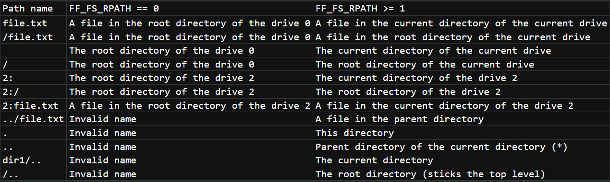
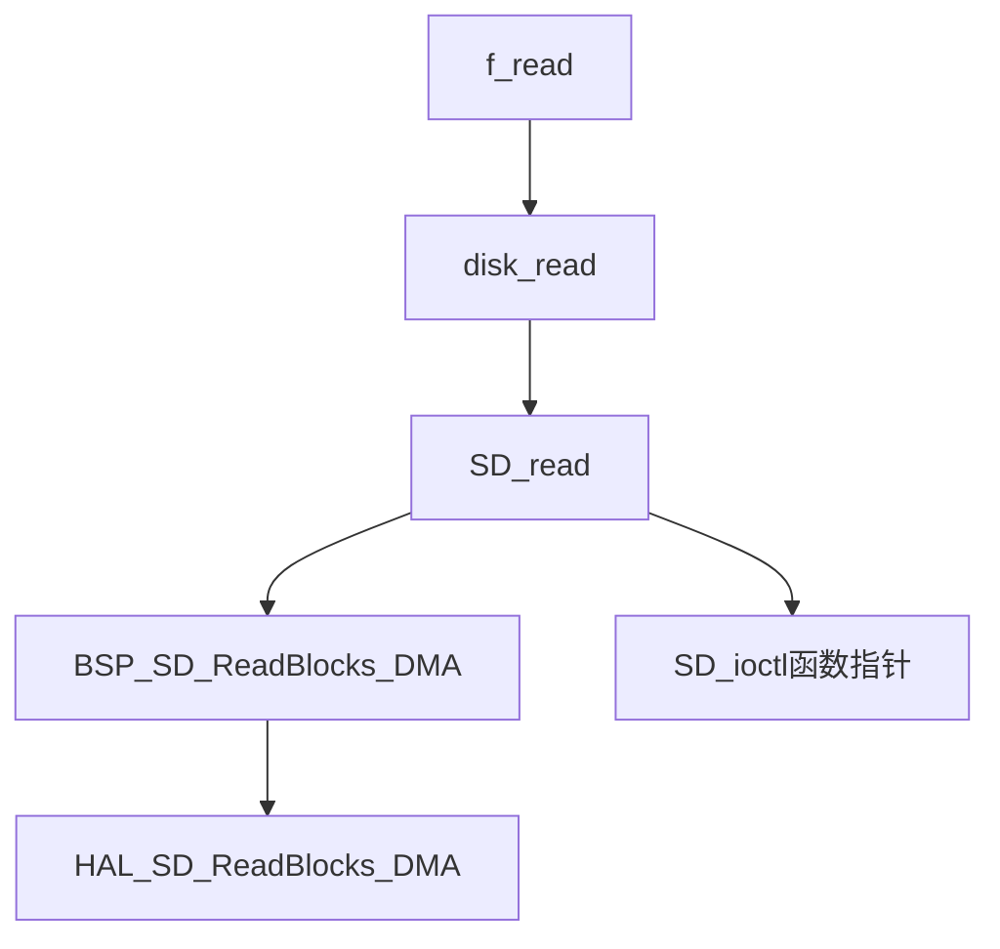

## 读卡模式 **SDIO** + **FATFS** + **DMA** + **FreeRTOS**
> 关于总线的宽度的设置 (手动更改CubeMX的bug)
> + SD卡在刚上电的时寻卡初始化的过程中，时采用单总线模式，所以`MX_SDIO_SD_INIT`函数初始化需要把`BusWide`设置为`SDIO_BUS_WIDE_1B`   
## FatFs  
### 一些要点
``` 
明确概念 ：
物理驱动：物理上的驱动,事物上的驱动(逻辑驱动器都与相同驱动器号的物理驱动器相关联)
逻辑驱动：windows上的 C: D:，FatFs 的 0: 1:
```
- Fatfs 的卷的标题驱动器前缀是数字(0-9)+冒号，比如说 `"0:/"`,一下是一些路径的意义，注意辨识
    ### Fatfs路径参考
    
- 注意文件名不能出现空格或者.（某些模式下允许，感兴趣请参考官网）
- 目前配置的打开文件的模式是：`FA_READ | FA_WRITE | FA_OPEN_ALWAYS `,即可读可写，如果文件不存在就创建新的文件

**FatFS(Fat File System)的实现逻辑**   
官网说明：[链接](http://elm-chan.org/fsw/ff/00index_e.html)（强烈建议边看代码边查官网）


**f_read的调用逻辑(fafts应用层->bsp层->HAL层)**

**关于Freertos栈大小的分配的问题**
- cubeMX中，总的栈空间默认是 1024*15 = 15360，目前分配时比较多的，等完善读写机制再分配
合适大小的栈空间

#  FreeRTOS任务的设计问题
- 一般情况下，SD卡是已经有了文件系统了，不需要使用`f_mkfs()`函数来创建FA卷。  
- 由于这段代码的存在，不开启freertos的内核，SD卡是无法初始化成功的,
    ```
    /*
    * check that the kernel has been started before continuing
    * as the osMessage API will fail otherwise
    */
    #if (osCMSIS <= 0x20000U)
    if(osKernelRunning())
    #else
    if(osKernelGetState() == osKernelRunning)
    #endif
    {
    #if !defined(DISABLE_SD_INIT)

        if(BSP_SD_Init() == MSD_OK)
        {
        Stat = SD_CheckStatus(lun);
        }
    ```
    所以我们挂载的操作都需要在内核启动的任务中开启，一种简单的方法就是在sd卡读写任务中创建一个`mount_open_flag`，判断是这个任务只进行一次。另外一种方案是为sd卡的挂在。    


- 每当sd卡的文件进行修改之后，都需要使用`f_close()`来保存文件的变更(官网中说的文件进行变更而不调用`f_close()`还可能到时文件系统崩溃)，所以我们需要将`f_open()`和`f_close()`在每个任务进程中都成对使用,而且是挨着使用。

TODO
- 解决最高频率25Hz 50Hz的问题，cubeMX里面到底应该配置多少合适
- 把pid设成1，drive name 改为 pid _STR_VOLUME_ID  
- 等完善读写机制再分配 合适大小的栈空间
- 使用官网提供的函数更改挂在卷的名字，改成string
- 接上位机，log第一条信息接入当前北京时间